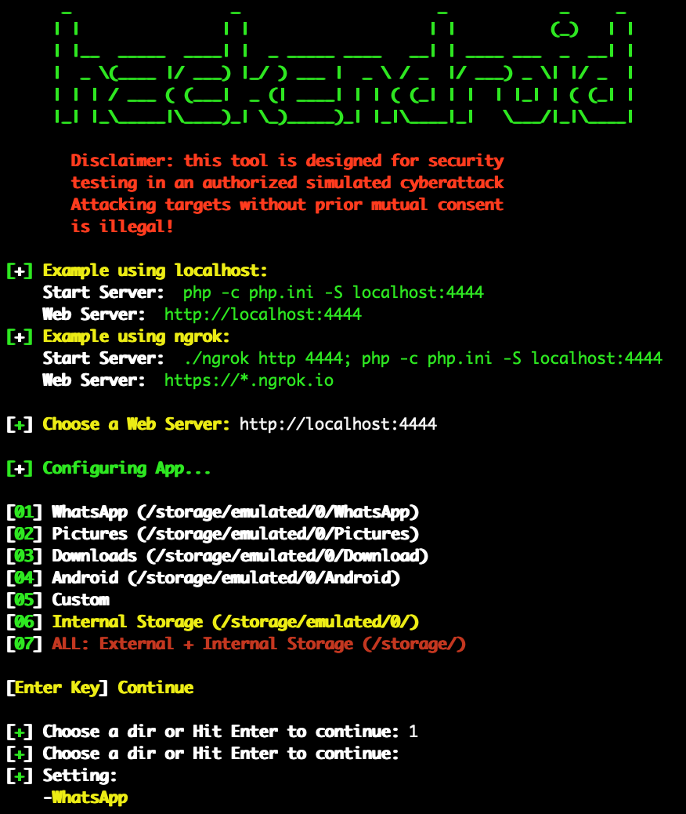

# finder v1.2

Hackendroid is a tool to access the files of any android device like WhatsApp, downloads, etc (or any external or internal storage files) by sharing the apk with the victim.

## Instagram: https://instagram.com/programemerz



### Features:

#### Works on every android device
#### Auto detect device
#### Access any external or internal storage files

## Legal disclaimer:

Usage of Hackendroid for attacking targets without prior mutual consent is illegal. It's the end user's responsibility to obey all applicable local, state and federal laws. Developers assume no liability and are not responsible for any misuse or damage caused by this program. 

### Usage:
```
git clone https://github.com/programemerz/hackendroid
cd hackendroid
bash hackendroid
```
